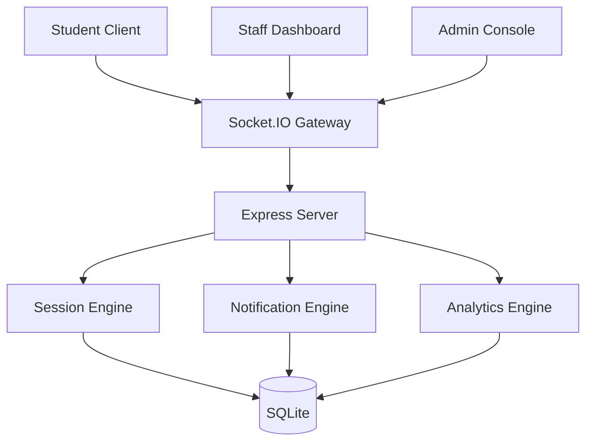

<div align="center">

# LOCUS

### Intelligent Library Space Management Platform

<p align="center">
  <a href="#">
    
  </a>
</p>

<p align="center">
  
  
  
  
  
</p>

---

### Your Seat. Not Your Bag's.

A next-generation library management ecosystem that combines real-time occupancy monitoring, AI-powered study recommendations, intelligent room booking, advanced analytics, and automated administration into a single unified platform.

</div>

---

# Platform Preview

<p align="center">
  
</p>

---

# The Problem

Modern academic libraries face a common challenge:

* Desks remain occupied while students are absent
* Staff lack real-time visibility into occupancy
* Students waste time searching for available seats
* Room bookings are managed inefficiently
* Study analytics are virtually nonexistent

LOCUS transforms traditional libraries into intelligent, data-driven learning environments.

---

# Core Capabilities

<table>
<tr>
<td width="50%">

### Smart Study Experience

* AI Seat Recommendations
* Personalized Study Analytics
* Multi-Method Check-In
* Live Session Tracking
* Study Streak Monitoring
* Goal Progress Tracking
* Achievement System
* Smart Room Booking

</td>

<td width="50%">

### Administrative Intelligence

* Real-Time Occupancy Monitoring
* Interactive Floor Maps
* Automated Desk Recovery
* Broadcast Notifications
* Utilization Analytics
* User Management
* System Configuration
* Multi-Format Reporting

</td>
</tr>
</table>

---

# Feature Ecosystem

```text
Student Platform
├── Smart Check-In
├── Active Sessions
├── Study Dashboard
├── Seat Finder
├── Room Booking
├── Study Analytics
├── Goal Tracking
└── Achievement Engine

Staff Platform
├── Live Floor Map
├── Desk Monitoring
├── Occupancy Analytics
├── Alert Management
└── Room Oversight

Admin Platform
├── User Management
├── Desk Management
├── Room Management
├── System Analytics
├── Booking Administration
└── Platform Configuration
```

---

# AI Recommendation Engine

LOCUS continuously analyzes study behavior and calculates personalized desk recommendations based on:

* Historical Usage
* Preferred Study Zones
* Noise Preferences
* Occupancy Patterns
* Availability Score
* Session History

```text
Recommendation Score

40% Previous Usage
25% Preferred Zone
15% Availability
10% Noise Match
10% Recent Activity
```

---

# Real-Time Infrastructure



---

# Platform Modules

## Student Experience

### Check-In System

* Quick Select
* QR Scanning
* Manual Desk Entry

### Session Lifecycle

```text
AVAILABLE
    │
    ▼
OCCUPIED
    │
    ▼
AWAY
    │
    ▼
ABANDONED
    │
    ▼
RESET
```

### Analytics

* Daily Study Hours
* Weekly Trends
* Monthly Reports
* Favorite Locations
* Streak Analysis
* Goal Tracking

---

## Staff Operations

### Interactive Monitoring

* Live Floor Layout
* Desk Inspection
* Session Management
* Alert Resolution
* Bulk Operations

### Reporting

* Occupancy Distribution
* Peak Hour Analysis
* Utilization Reports
* Export Tools

---

## Administrative Control

### User Administration

* Create Users
* Modify Roles
* Suspend Accounts
* Activity Monitoring

### Infrastructure Management

* Room Configuration
* Desk Allocation
* System Policies
* Notification Broadcasts

---

# Technology Stack

<table>
<tr>
<td><strong>Frontend</strong></td>
<td>React 18 · TypeScript · Vite · TailwindCSS · Recharts · Socket.IO</td>
</tr>

<tr>
<td><strong>Backend</strong></td>
<td>Node.js · Express · TypeScript · Socket.IO</td>
</tr>

<tr>
<td><strong>Database</strong></td>
<td>SQLite · WAL Mode · Indexed Queries</td>
</tr>

<tr>
<td><strong>Exports</strong></td>
<td>CSV · Excel · JSON · PDF</td>
</tr>
</table>

---

# System Metrics

| Category                | Count |
| ----------------------- | ----- |
| Student Features        | 40+   |
| Staff Features          | 25+   |
| Admin Features          | 50+   |
| API Endpoints           | 60+   |
| Real-Time Events        | 13    |
| Notification Types      | 7     |
| Export Formats          | 4     |
| User Roles              | 3     |
| Charts & Visualizations | 10+   |
| Total Features          | 170+  |

---

# Why LOCUS

Unlike traditional library systems, LOCUS combines:

* Artificial Intelligence
* Real-Time Synchronization
* Gamification
* Behavioral Analytics
* Predictive Insights
* Automated Enforcement
* Modern UX Principles

into a single integrated platform designed specifically for academic institutions.

---

<div align="center">

### Built for Modern Libraries

Real-Time • Intelligent • Scalable

</div>
